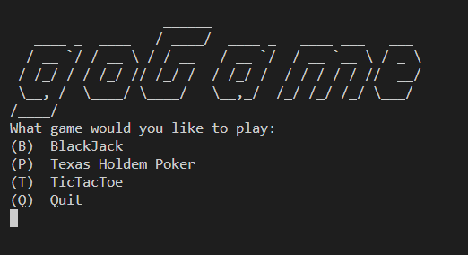
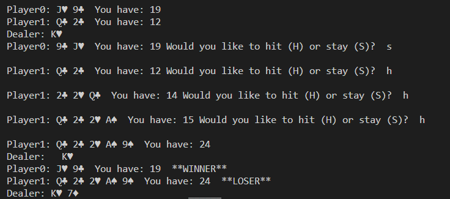
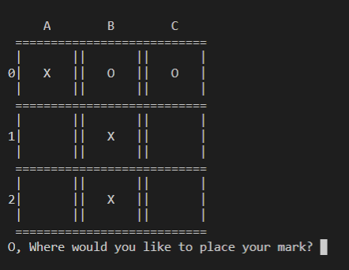

<h1>goGame</h1>
<h2>What is goGame</h2>

goGame is a developing collection of games that run in terminal written in Go-Lang

<h2>Current Games</h2>
<h3>Main Menu</h3>

Current list of games

<h3>BlackJack</h3>

Game mechanics are working for playing 21, but a betting system still needs to be implemented.

<h3>Tic-Tac-Toe</h3>

Currently is two player, but will need an AI to play against.

<h3>Texas Hold'em Poker</h3>

Still under development, players are dealt a hand. Need to add hand evaluation and betting system.

<h2>Future Work</h2>

Feel free to reach out with suggestion or contributions as new games are added.

